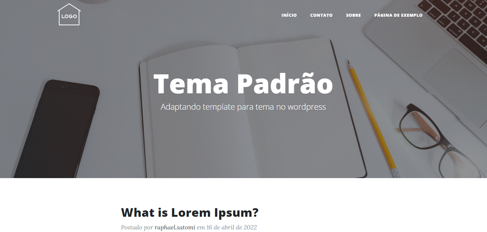
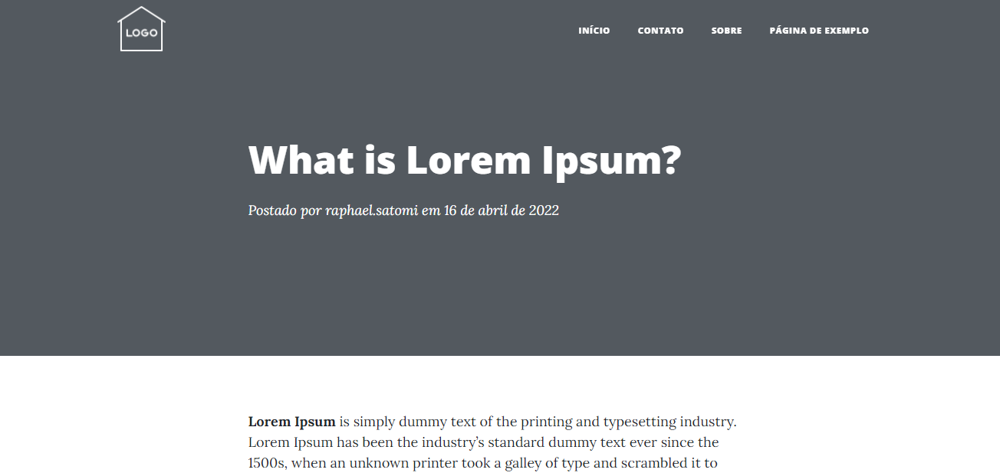
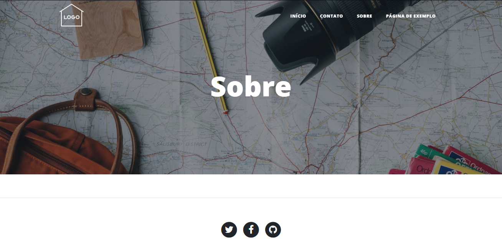

# Tema Padrão WP
Adaptando template simples cleancode para wordpress no curso de wordpress do b7Web   
--- 

## Páginas

---
## Contribuidores

- Raphael Satomi Gomes de Andrade <raphaelsatomi@gmail.com>
